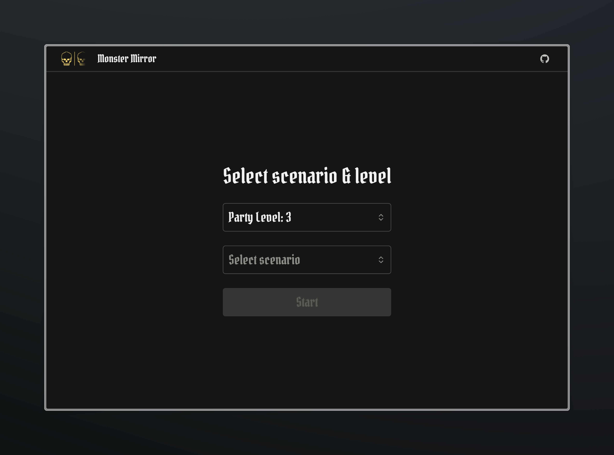
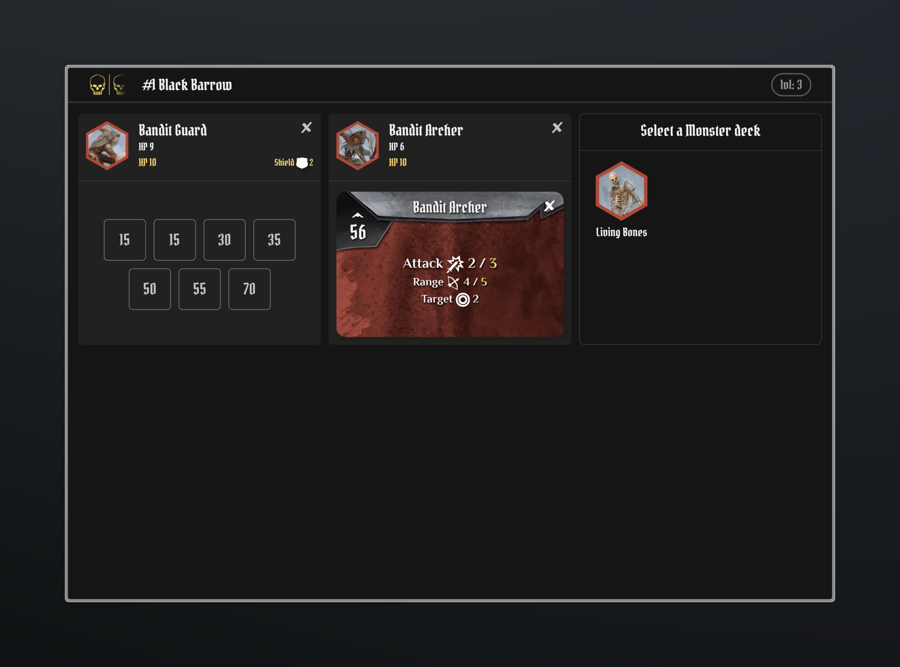

# 

Monster Mirror enhances your Gloomhaven journey by providing a convenient way to view monster ability cards. Designed as a **companion app**, it seamlessly integrates with the physical monster ability cards rather than serving as a replacement. This ensures a streamlined and complementary experience, preserving the tactile engagement of the original game components.

## Preview

Select Party level and the scenario you want to play.

Then you can add / remove the monsters from the scenario and flip the corresponding ability cards. The Party level is taken into account when calculating the attack and range.

## Why

In our group of 4, we distribute responsibilities for handling different aspects of the Gloomhaven board game. One person manages coins, another sorts initiative tokens, and someone else oversees monster ability cards and elemental tracking. Throughout our campaign, we observed an escalation in the complexity of monster abilities.

A pivotal moment arose when we failed a scenario due to a mishap – my friend unintentionally generated darkness, and we struggled to read the ability cards from across the table. This experience prompted me to develop this app.

The app simplifies the process of handling new monster abilities. With just the initiative information, we can easily select the appropriate card. Additionally, the app factors in the party level to calculate the final values for attack, movement, range, and more.

## Development

This project is build with [NextJS](https://github.com/vercel/next.js) and hosted on [Vercel](https://vercel.com), it can also be installed as a PWA and added to your homescreen. The app is optimized to work work on tablet size but can also be viewed on mobile or desktop.

- `npm run dev`: Runs the dev server
- `npm run build:svg`: Builds the SVG in an SVG Sprite
- `npm run build`: Builds the Next.js project

## Inspiration

This project was heavily inspired by [Gloomy Companion](https://github.com/johreh/gloomycompanion) especially the macro and logic for automatically calculating the ability cards.

I also want to thank the excellent [Gloomhaven Card Browser](https://github.com/cmlenius/gloomhaven-card-browser) which allowed me to easily verify and check the implementation.

## License

This project is [licensed MIT](./LICENSE) except for all artwork / thumbnails and images which are licensed under creative commons license [BY-NC-SA 4.0](https://creativecommons.org/licenses/by-nc-sa/4.0/).
